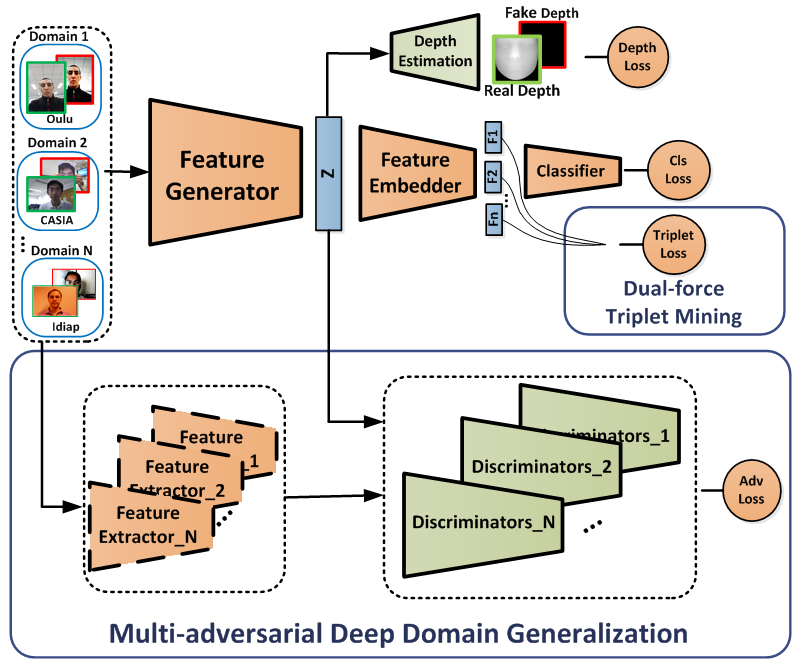

# CVPR2019-MADDoG
Pytorch codes for <a href=http://openaccess.thecvf.com/content_CVPR_2019/papers/Shao_Multi-Adversarial_Discriminative_Deep_Domain_Generalization_for_Face_Presentation_Attack_Detection_CVPR_2019_paper.pdf> Multi-adversarial Discriminative Deep Domain Generalization for Face Presentation Attack Detection</a> in CVPR 2019 

The framework of the proposed method:



# Setup

* Prerequisites: Python3.6, pytorch=0.4.0, Numpy, TensorboardX, Pillow, SciPy, h5py

* The source code folders:

  1. "models": Contains the network architectures and the definitions of the loss functions.
  2. "core": Contains the pratraining, training and testing files. Note that we generate score for each frame during the testing.
  3. "datasets": Contains datasets loading
  4. "misc": Contains initialization and some preprocessing functions
  
# Training

To run the main file: python main.py --training_type Train

# Testing

To run the main file: python main.py --training_type Test

It will generate a .h5 file that contains the score for each frame.

# Acknowledge
Please kindly cite this paper in your publications if it helps your research:
```
@InProceedings{Shao_2019_CVPR,
author = {Shao, Rui and Lan, Xiangyuan and Li, Jiawei and Yuen, Pong C.},
title = {Multi-Adversarial Discriminative Deep Domain Generalization for Face Presentation Attack Detection},
booktitle = {The IEEE Conference on Computer Vision and Pattern Recognition (CVPR)},
month = {June},
year = {2019}
}
```

Contact: ruishao@comp.hkbu.edu.hk

